# 59 · 四百年战役 v2 审阅文档

2026-10-01 · Claude · 第四版：你 10 月 1 日晚的四条意见（政治体制与政治改革、国体评语的称呼、民心与生活怎么算、二十世纪的大失业与人口下降）做完之后的版本。第三版（八条意见：字号、价格说法、科技树、政令与国家形态、民生、纪事、产业、图片）的内容都还在 §2。设计规格见 [docs/57](57_campaign_v2_design.md)，逐项落地记录见 [docs/58](58_campaign_v2_status.md)（§9 是后几轮），政治改革与二十世纪经济的设计与数据见 [docs/61](61_politics_and_late_economy.md)，这一轮要的图见 [docs/62](62_asset_requests_v8.md)。

**怎么读**：只有十分钟，就看 §0、§1 然后去玩；这一轮四条意见的答复与改动看 §10（配截图）；第三轮八条意见看 §2；试玩时对照 §9 的审阅清单；要你拿主意的事在 §8。

---

## 0 一页速览

**这是什么**：从 1600 年走到 2000 年的国家经营游戏，每回合一季，全程 1,600 季。你执掌一个以农为本的国家：

- 四个地区：北原（旱地、牧场、煤）、中州（京城、水田、瓷土）、海岬（港口、盐、渔场）、西岭（山地、林木、铁铜）；
- 四个阶层：农户、工匠、商贾、士绅，各有收入、各有要买的东西、各有民心；
- 85 样货、82 种建筑（共 215 种做法）、49 项科技、27 道政令、31 种事件、6 个外国伙伴、18 座地标；
- 10 种政体、12 项改革、4 种外部局势（革命风潮、列强叩关、对外战争、经济危机），在政令页的「政治改革」里；
- 四个时代：农商 → 工场与商路 → 蒸汽与铁路 → 电气与现代国家。世界会先走一步；你落后，百姓就嫌日子比不上外面。

**目标**：让百姓吃饱穿暖、日子一年比一年好；管好国库；把国家带进新时代。三条危机线（财政、民生、朝廷威信）任何一条在「崩溃在即」停满八季，这一局就结束；走到 2000 年春算圆满。什么都不管，国家大约撑一百年。

**这一轮：你的四条意见**

| 你的意见 | 现在 | 详见 |
|---|---|---|
| 1 政治体制不够多样；改政体要靠改革局势或外部局势，放进专门的政治改革界面 | 政体从 5 种加到 10 种（新增商人共和、军政府、军阀割据、一党执政、保护国），不能再直接下令换。政令页新开「政治改革」页签：推行 12 种改革局势（几年推完，推到 35%、70% 各有一个关口要拿主意）；外部局势有革命风潮、列强叩关（可转成战争、签不平等条约、沦为保护国）、经济危机（可以工代赈）；革命压力、列强压力逐项写明来由 | §10.1 |
| 2 国体评语太少 | 从 18 句扩到 141 句：10 种政体 × 3 种施政风格，再按眼下的局面（危亡、战事、革命、萧条、盛世、落后、穷兵、闭关、通商、工业、农本）换说法，如「开发独裁的军政府」「兴办洋务的帝国」「列强的商埠」「群雄逐鹿」 | §10.2 |
| 3 民心和生活怎么算、多少算高、怎么提高 | 公式、分档与提高的办法写在 §10.3；游戏里「怎么玩」新增「生活、民怨、民心、威信」与「政体与政局」两段 | §10.3 |
| 4 二十世纪总是大失业、人口下降 | 查出八个原因（人口转型次序反了、煤被矿藏卡死、化肥链起不来、电的销路算错……）逐个改掉：二十世纪 8 局人口都一路涨到 2000 年；失业分成「城镇失业」（约一成）与「农村富余劳力」 | §10.4 |

**第三轮的八条意见**

| 你的意见 | 现在 | 详见 |
|---|---|---|
| 1 字太小，费眼 | 新增「界面大小」100%—200%，默认跟着 Windows 的显示缩放；放大后排版自己调整，到 200% 也不挤坏 | §2.1 |
| 2 「贱 8%」不专业 | 一律改成「持平 / +8% / −8%」「高于国内价 12%」「价是常价的 111%」，文案表里「贱」字一处不剩 | §2.2 |
| 3 科技要图标、像文明 6 | 新科技树：时代从左到右、前置连线、节点有图标、进度、解锁的小图，可拖动；下方详情卡 | §2.3 |
| 4 政令多些图、评价国家形态 | 政令页顶部「当今国家」：一句评语（「宽容仁厚的帝国」「堕落的工人国家」……）＋ 徽记 ＋ 四条取向刻度；新增「政体」「劳工」两道政令；政令分六类、每道一张带图的卡 | §2.4 |
| 5 民生不直观 | 阶层画像卡（表情随民心变）、民心地图（每地每阶层一张小脸）、需要图标环、收入彩条 | §2.5 |
| 6 纪事要特别重视 | 新「国史」：四百年时间轴、每十年一张卡、「史官曰」、里程碑大卡；开局第一页就有；事件写明选了哪一条 | §2.6 |
| 7 产业可视化 | 商品按部门分组的图卡（物资图、较常价、产需条、缺口）；产业链图带图标和到货条 | §2.7 |
| 8 缺的图列全 | [docs/60](60_asset_requests_v7.md) 列了 354 张，Codex 全部画好；检查后已接入：科技徽章、几何画风的人物、政令配图、国家徽记、里程碑画、页签与按钮小图标等 | §2.8 |

**前两轮的七条意见**（舆图、白话、原料与改造、托管、顾问、可玩性、图片）的落地情况见 §3。

**现在的数**（8 个随机种子，详见 §5；这一轮用最终的内容重跑过）

- 什么都不管：1672—1698 年亡国（目标 1650—1730 年），亡国前至少两年有顾问警示和危机进度。
- 全交给托管（事件取向「先顾百姓」）：8 局都走到 2000 年，托管一路推「开明君主 → 君主立宪 → 议会共和」；进入工场时代 1686—1715 年，蒸汽时代 1794—1828 年，电气时代 1895—1915 年；1999 年威信 45—50%、生活 85—91%、城镇失业 7—13%，人口 5,578—6,287 万（二十世纪一路上涨）。
- 全部测试 645 项通过；脚本解析闸门全过。

**最想请你看的五件事**

1. 「政治改革」页签：读档 `review_1878`（立宪运动推到 68%、列强兵临城下），看局势卡、关口、两种压力、各种政体（§10.1）。
2. 结束一季后弹出的「政局待决」：选项写得清不清楚，代价合不合理（§10.1）。
3. 评语：多玩几种政体与局面，看称呼准不准、还缺什么说法（§10.2）。
4. 「怎么玩」里新的两段：生活、民心、威信讲得够不够明白（§10.3）。
5. 二十世纪：读 `review_1935` 往后快进，看失业、人口、经济危机（§10.4）。

**图片**：新政体的徽记、改革与局势配图、国史大卡等 47 张还没有（显示占位圆章），清单 [docs/62](62_asset_requests_v8.md) 交 Codex。第三至第七批的图片已接进游戏，但还只在本机，没有提交进仓库（见 §8）。

---

## 1 怎么试玩

**打开**：双击 `Jingwei` 文件夹里的 `play.bat`（全屏打开）。按 **F11** 切换全屏与窗口；**退出游戏**在顶栏「存档」弹窗的最下面（也可以 Alt+F4）。窗口标题里的「(DEBUG)」是因为直接用 Godot 运行工程，不影响玩。

**字太小**：顶栏「存档」→「界面大小」，五档 100% / 125% / 150% / 175% / 200%，点了马上生效，下次打开照用；也可以按 **Ctrl+加号 / Ctrl+减号**。见 §2.1。

**新开一局**：开局窗口里可以选

- 「推荐：琐事交给托管」：研究、改造、外贸、事件由托管代办，营造与财政由托管拟好、你来批准；
- 「全部自己来」：托管不动手，顾问照常进言；
- 地图种子决定年成、事件和世界走向；同一个种子、同样的命令，结果完全一样。

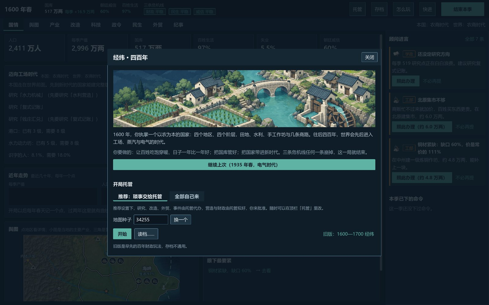

**第一季这样上手**

1. 「国情」页：上面是六个大数；「迈向工场时代」写着还差哪几项，每项都有「去办」；下面是三条危机线。
2. 右侧「顾问进言」：觉得有道理就点「照此办理」，不想听就点「不必再提」。
3. 顶栏「托管」：看看六个领域都交给谁了。「拟办」的事会出现在右侧栏，等你批准或驳回。
4. 点「结束本季」（Ctrl+Enter）。平常季度只在底部提示一行，有大事才弹季报。

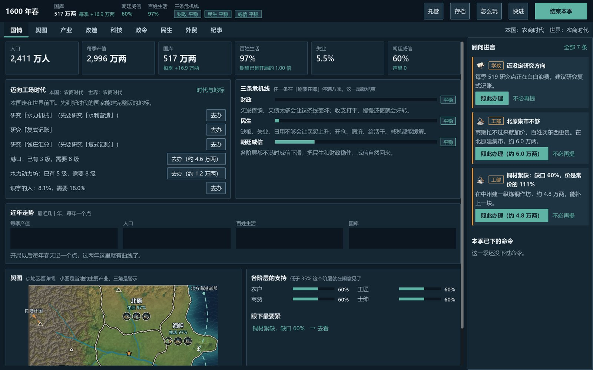

**想快点看到后面**：顶栏「快进」→ 一年 / 五年 / 二十年。遇到大事（时代更替、危机升级、要你拿主意的事件与政局关口）会停下，并写明为什么停。

**直接看中后期**：「存档」里有三个审阅用的档，点「读取」（这一轮用最终的内容重新生成过）：

- `review_1730`：1730 年春，工场时代，政体已是开明君主，局面平稳（威信 57%）；
- `review_1878`：1878 年冬，蒸汽时代：「立宪运动」推到 68%，**列强兵临城下等你拿主意**。这个档的事件托管改成了「拟办」：右栏有托管拟好的「变法图强」，你可以批准，也可以去「政令 → 政治改革」自己选（威信 40%）；
- `review_1935`：1935 年春，电气时代，议会共和（1689 年开明、1879 年立宪、1884 年共和），电力、煤还缺（威信 47%）。

三个档都是从全托管的局面接过来的（种子 1），托管改成了「推荐」设置。

**快捷键**：数字键 1—9 切换九个页面；Ctrl+Enter 结束本季；Ctrl+Z 撤回本季最后一道命令；Ctrl+加号 / 减号 调界面大小；Esc 关闭弹窗；F11 全屏 / 窗口。

**旧版**：开局窗口右下角「旧版：1600—1700 经纬」还能进早先的百年财政玩法（存档不通用）。

---

## 2 第三轮：八条意见逐条看

### 2.1 字太小 → 「界面大小」

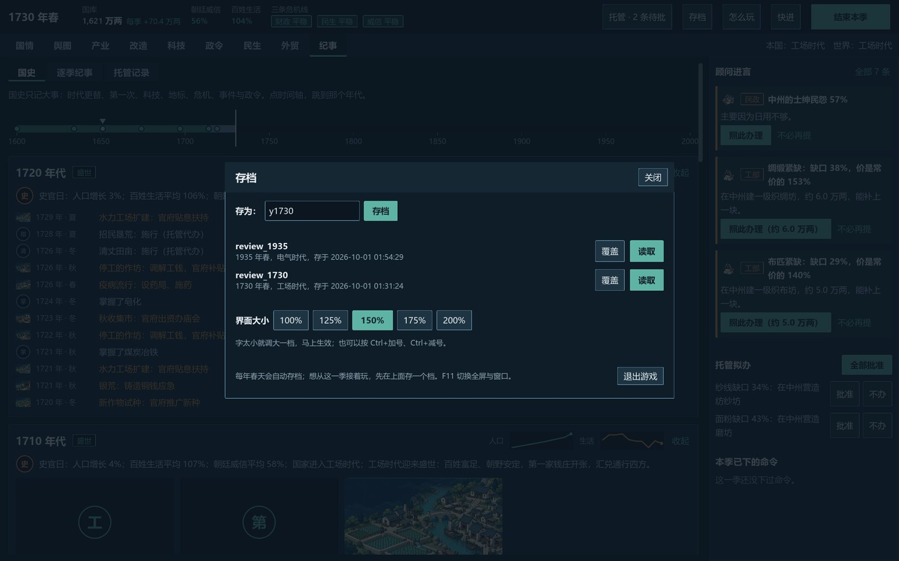

- **默认跟着 Windows 的显示缩放**：Windows 设成 150%，游戏就开 150%；设成 200%，就开 200%。
- **自己调**：「存档」窗口里的「界面大小」五档，或 Ctrl+加号 / 减号；马上生效，记下来，下次照用。
- **屏幕放不下的档不让选**：放大后界面至少要有 1280×720 的地方，再大就挤坏了。2560×1600 的屏最大 200%，1920×1080 的屏最大 150%；放不下的那几档按钮是灰的。
- **放大以后排版自己调整**（这一轮专门在 200% 下逐页看过）：
  - 顶栏收紧，「本国：… 世界：…」那一行挪到页签行的右端；
  - 右侧顾问栏从 360 收到 300 宽，「不必再提」放不下就折到下一行；
  - 国情页左右并排的两块改成上下排，走势改两列；
  - 民生的四张阶层卡放不下就两张一排；
  - 产业页左边的商品卡按宽度排三列、两列或一列，右边的链图始终留足地方；
  - 舆图右侧详情收窄，上方四张地区卡改成短行；
  - 实在放不下的内容出一条横向滚动条，不会再钻到右边顾问栏底下。

下面是 200% 的样子（逻辑尺寸 1280×800，相当于 1920×1080 的屏开 150%）：

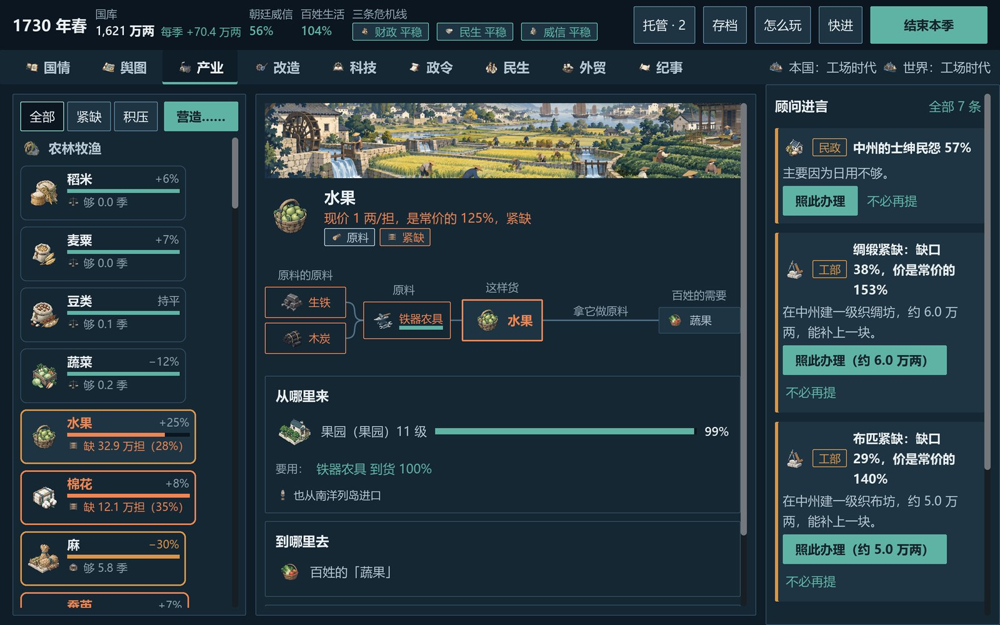

**请你看**：默认大小合不合适；你常用的那一档，各页有没有挤、有没有字被截掉。

### 2.2 价格说法

- 产业页商品卡的右上角：和常价比，写「持平」「+8%」「−8%」（差不到 5% 写持平；贵两成五以上用橙红字、贱两成以上用赭色字，其余灰字）。
- 外贸页：「高于国内价 12%」「低于国内价 16%」「与国内价持平」。
- 产业链与顾问：「现价 19 两/担，是常价的 111%」「缺口 60%，价是常价的 111%」。
- 原来的「贵 30% / 贱 20%」这类说法全部去掉（`ui/text/zh_cn/` 里查过，一处不剩）。

### 2.3 科技树（仿文明 6）

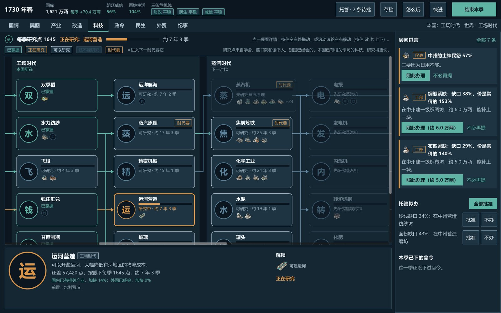

- **布局**：时代从左到右，一个时代一栏，标出「本国所在」「下一时代」；前置之间画连线；按住空白处拖动，或滚轮左右移动；第一次打开自动移到本国所在的时代。
- **节点**：圆形图标、名字、一行状态（已掌握 / 研究中·约几年 / 可研究·约几年 / 先研究某某）、进度条、**解锁的小图标**（能建的建筑、新做法、能推行的政令、政体的新档；多了显示「+N」）；进下一时代要的标「时代要」。颜色：青绿已掌握、橙色正在研究、白边可以研究、灰的还不能研究。
- **详情卡**：做什么用、还差多少点约几年、国内相关产业与外国已会带来的加速、前置、哪些外国已经会了；右边「解锁」逐项配图；「定为研究方向」一键下令。
- **徽章**：Codex 只画科技的主体（透明底），四个时代各有一个共用的框（木、铜、铁、钢）；界面把底板、主体、框三层叠起来，主体按看得见的部分自动放正。已掌握、研究中在框外再描一道状态色，还不能研究的整体压暗。树的每个时代栏还铺了一张淡淡的时代底图。

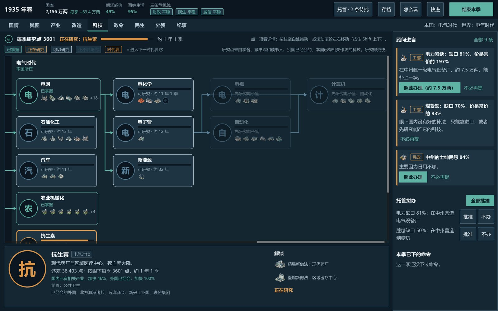

**请你看**：是不是你要的「图标搭配说明」；节点上的信息够不够、多不多。

### 2.4 政令与国家形态

（**第四轮已改**：政体不再是政令，挪到政令页的「政治改革」页签，只能靠改革局势或外部局势改变；政体 10 种，评语 141 句。见 §10.1、§10.2。下面是第三轮的样子。）

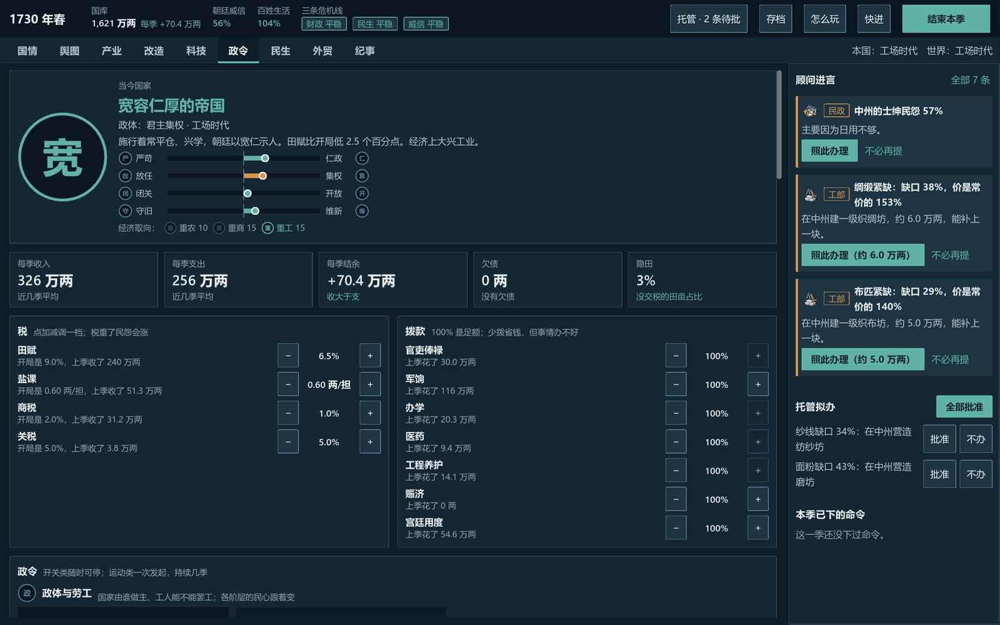

**「当今国家」**（政令页最上面）：

- **一句评语**，按政体 × 施政风格定：

  | 政体 | 宽仁 | 守成 | 严苛 |
  |---|---|---|---|
  | 君主集权 | 宽容仁厚的帝国 | 守成持重的帝国 | 严刑峻法的帝国 |
  | 开明君主 | 开明仁厚的王朝 | 开明务实的王朝 | 开明其表、严苛其里的王朝 |
  | 君主立宪 | 温和宽厚的立宪王国 | 稳健的立宪王国 | 铁腕的立宪王国 |
  | 议会共和 | 安康的共和国 | 务实的共和国 | 冷酷的共和国 |
  | 社会主义 | 福利的工人国家 | 工人的国家 | 堕落的工人国家 |

  另有几种特别的组合：海禁加重农抑商的帝国是「闭关自守的农本帝国」，开海重商的帝国是「通商四海的帝国」，重商又开放的共和国是「商人的共和国」；**社会主义却严禁罢工，不管别的政令多宽厚，一律是「堕落的工人国家」**（你举的例子，有测试守着）。

- **施政风格怎么算**：常平仓、赈济、蠲免、兴学、义务教育、社会保险、工厂法、环境法、田赋比开局轻，往「宽仁」走；征发徭役、捐纳、盐专卖、严禁罢工、田赋加重、赈济拨款不到六成、欠发俸饷，往「严苛」走。
- **一枚徽记**（政体 × 风格，15 种）、政体与时代、一段说明（施行了哪些、哪些让百姓有怨言、税比开局高低多少、经济上偏重什么），君主国说「朝廷」，共和国和工人国家说「政府」。
- **四条取向刻度**：严苛—仁政、放任—集权、闭关—开放、守旧—维新；再加经济取向（重农 / 重商 / 重工）。

上面那张是 1730 年的审阅存档：施行着常平仓、兴学，君主集权，正好是「宽容仁厚的帝国」。下面这张是把 1935 年的档改成社会主义、再严禁罢工：

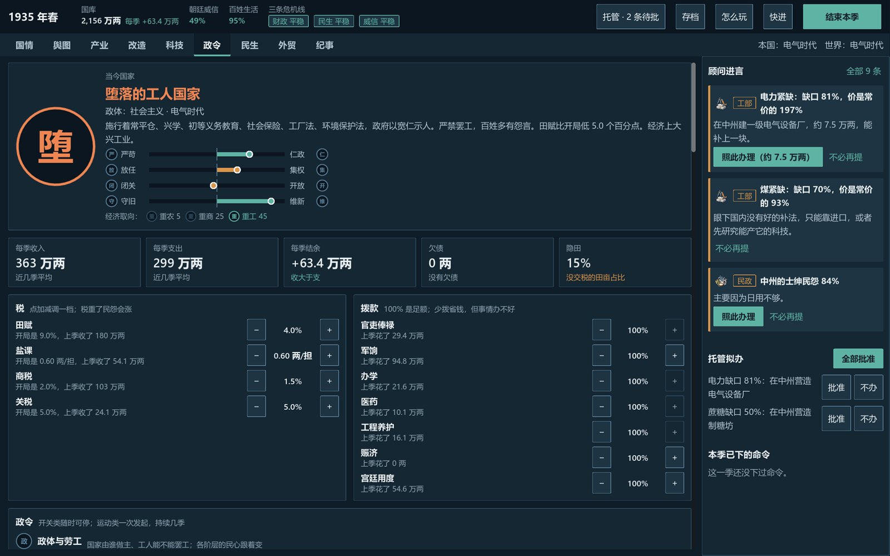

**新加的两道政令**（分档，放在「政体与劳工」一类）：

| 政令 | 档 | 什么时候能选 | 效果 |
|---|---|---|---|
| 政体 | 君主集权 | 开局 | 开局的样子，不加不减 |
| | 开明君主 | 工场时代，研究活字印刷后 | 研究 +5%、衙门效率 +3%；士绅、商贾略满意 |
| | 君主立宪 | 蒸汽时代，研究电报后 | 民间投资 +10%、利息 −10%；商贾满意，士绅略不满 |
| | 议会共和 | 蒸汽时代，研究新式教育后 | 民间投资 +15%、识字 +10%；商贾、工匠满意，士绅不满 |
| | 社会主义 | 电气时代，研究电网后 | 民间投资 −40%、工匠民怨 −15%；工匠、农户满意，商贾、士绅很不满 |
| 劳工 | 严禁罢工 | 蒸汽时代起 | 作坊投资 +10%、工匠民怨 +10%；商贾满意、工匠不满 |
| | 不加干预 | （默认） | 不加不减 |
| | 工会合法 | 蒸汽时代起 | 作坊投资 −10%、工匠民怨 −10%；工匠满意、商贾不满 |

政体改一次要隔 16 季才能再改。默认的两档不加不减，所以加了这两道政令，平衡不受影响（§5 重跑过）。托管不碰这两道，改不改政体留给你。

**政令卡**：28 道政令分六类（政体与劳工、税制与财政、民生、文教、商贸、工业），每类有小图标；每道一张卡：配图（分档的政令每一档一幅，选哪档换哪幅）、现在第几档、对各阶层民心的影响（「农户 +4」这样的小标签）、还要什么科技或时代（档位按钮灰着，悬停写明）。四条取向刻度两头、经济取向也都配了小图标。

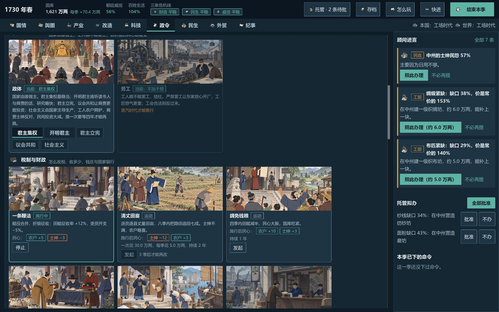

**请你看**：评语准不准、有没有你想加的组合；政体那几档的效果和门槛合不合理。

### 2.5 民生

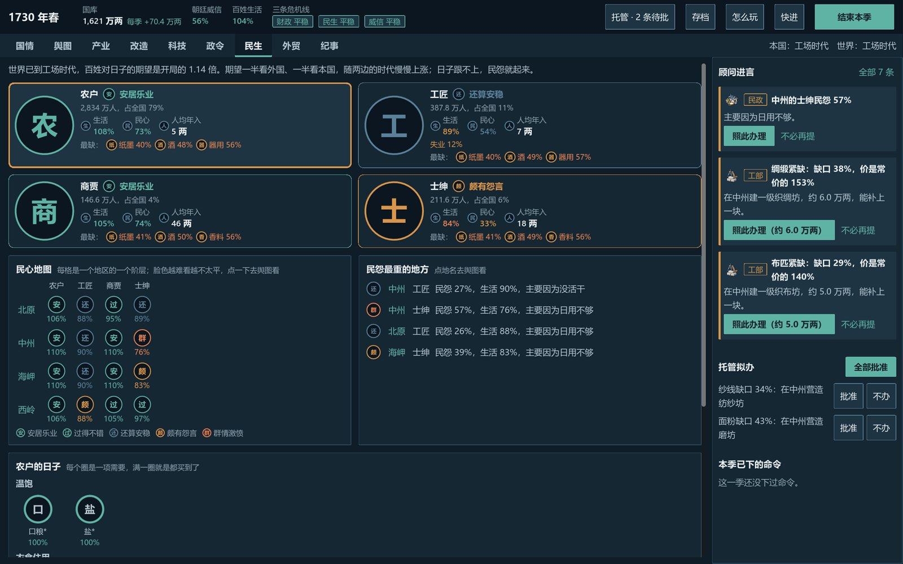

- **四张阶层卡**：画像（简洁几何画风，你定的；按时代换衣着，按民心换表情：舒心、平常、不满）、一句话的光景（安居乐业 / 过得不错 / 还算安稳 / 颇有怨言 / 群情激愤）、人数与占全国几成、生活、民心、人均年入、失业（多时才写）、**最缺的三样**（需要的小图标加「满足几成」）。点卡片，下面就换成这个阶层的日子。
- **民心地图**：行是地区（带地区小图标）、列是阶层，每格一张小脸加生活水平。小脸外面套一圈颜色（青绿到橙红五档），脸小到看不清表情时颜色照样说明好坏；悬停写民怨和主因；点一下去舆图。
- **民怨最重的地方**：哪个地区、哪个阶层、民怨多少、生活多少、主要因为什么（没活干 / 日用不够 / 缺粮……），点地名去舆图。
- **这个阶层的日子**：需要按「温饱、衣食住用、讲究、新时代的东西」分组，每项一个**图标环**，满一圈就是都买到了（青绿够、赭色差一些、橙色差得多）；有生活场景画时放在最上面；最下面一条**收入彩条**：工钱、经营与地租、官府发放各占几成。

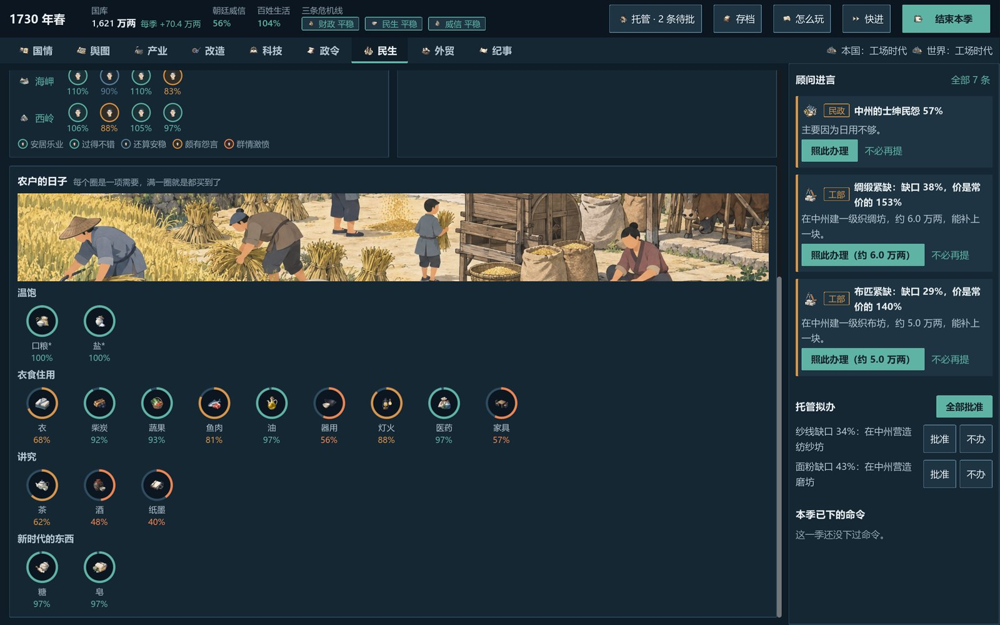

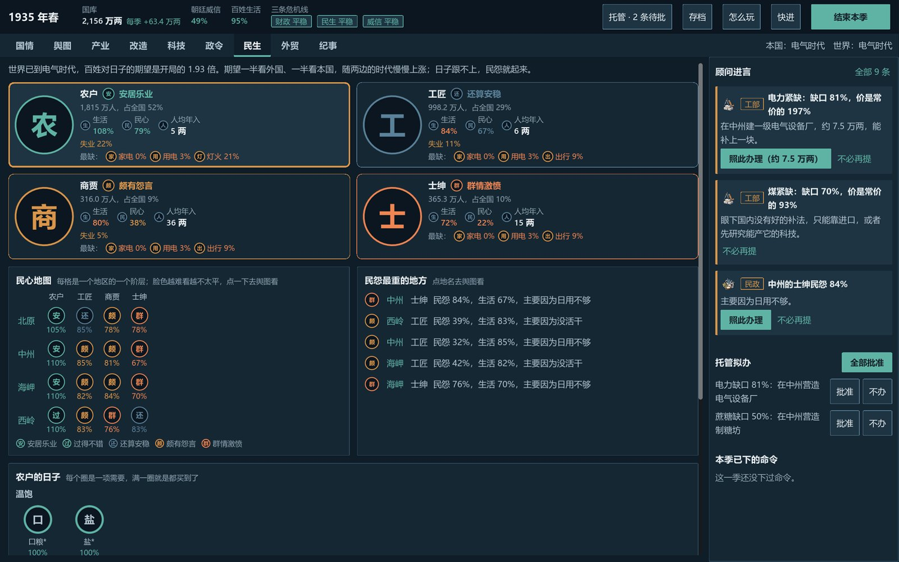

1935 年这张能一眼看出后期的毛病：四个阶层最缺的都是家电、用电、出行，商贾「颇有怨言」、士绅「群情激愤」，民心地图里士绅那一列一片橙。

### 2.6 纪事（重点）

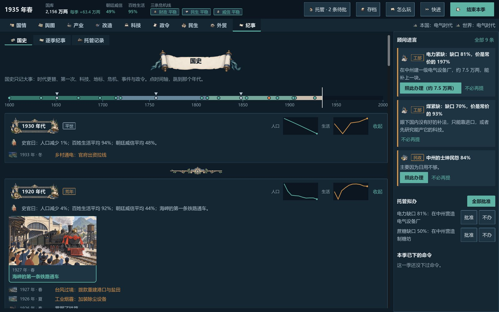

「纪事」页现在有三栏：**国史**、逐季纪事、托管记录。国史是这一轮的重点：

- **只记大事**：本国与世界的时代更替；「第一次」与里程碑（开国，第一座水力纺纱、运河通航、蒸汽机、炼钢、铁路、电厂、汽车、钱庄、远洋船队、电报、电视、计算机，人口过三千万、四千万、五千万、六千万，各时代的盛世）；掌握的科技；建成的地标；危机升到「危急」以上；事件的抉择；政令；商约；新伙伴；终局。存档里一直留着，最多三千条。
- **时间轴**：1600—2000 年一条，按本国的时代分色；三角标世界进入新时代，圆点标里程碑，红点标危机；竖线是现在；点一下跳到那个年代。
- **每十年一张卡**：
  - 标题「1720 年代」，旁边一个评语：盛世（生活平均 105% 以上、威信平均五成五以上）、治世（生活 98%、威信四成五以上）、平世、荒年（有一年生活跌到八成五以下）、乱世（威信平均不到三成五）、危亡之秋（有危机到了「崩溃在即」）；
  - 人口、生活两条小折线；
  - **「史官曰」**一句：人口增减几成、生活平均、威信平均，再加这十年的时代更替、危机和几件大事；
  - 大事用**大卡**（里程碑画，或时代画、地标画、事件画），其余一行一条，前面带小图标；
  - 最近的六个年代默认展开，更早的点「展开」。
- **配图与装饰**：卷轴页眉写「国史」，每个年代的标题写在题签框里，年代之间一道分隔花纹，「史官曰」前一方史官印。大卡配 29 种里程碑画（开国、第一座水力纺纱工场、运河通航、第一台蒸汽机、第一条铁路……四百年走完）。民生危机按主因配图：挨饿配「大饥荒」，民怨配「民变四起」（`review_1935` 的 1870 年代就是一场饥荒，展开那个年代能看到）；比世界先进入新时代配「领先世界」，改政体配「政体更替」。三个栏目的页签也有小图标。
- **开局第一页就有**：「1600 年代 · 史官曰：新君即位，国家开始了四百年的历程。」配开国画（新年里的都城）。
- **事件写明选的是哪一条**：「疫病流行：设药局、施药」「银荒：铸造铜钱应急」；托管代选的注明「（托管代选）」。原来写「选了第 1 项」。

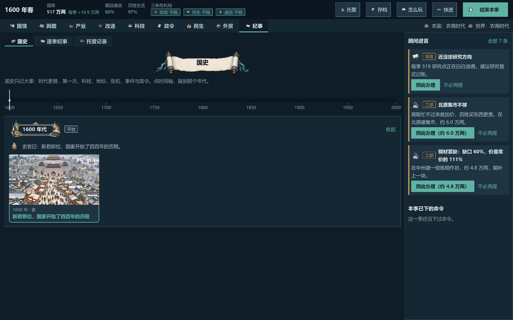

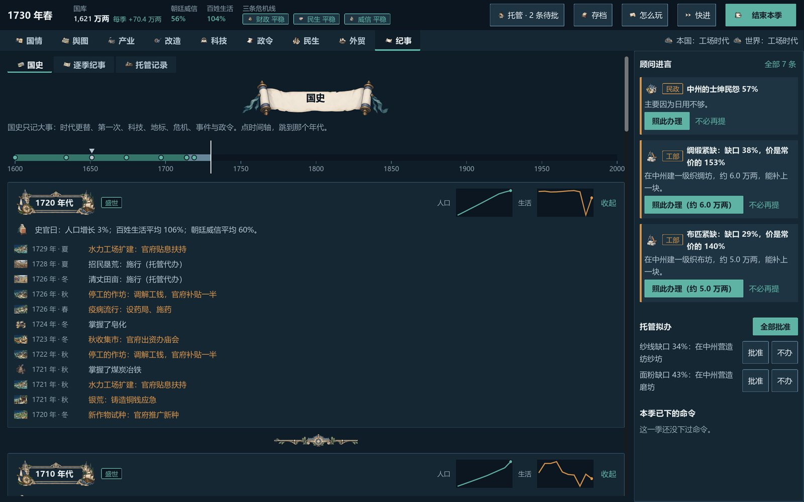

「逐季纪事」是原来那份按季的流水账（最近 400 条），可按时代、危机、事件、营造、民间投资、科技、政令、财政、外贸筛选；「托管记录」单独一栏，写明托管替你办了什么、为什么。

**请你看**：国史读起来像不像一部「国家的历史」；哪些事该记没记、哪些不该记；「史官曰」要不要写得更有文采。

### 2.7 产业可视化

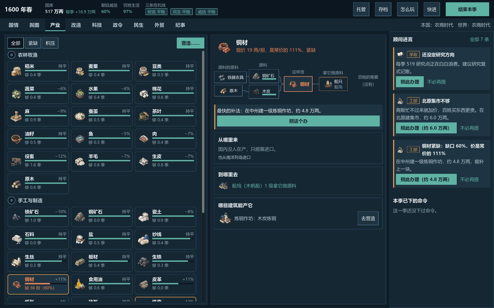

- **左边：商品图卡**，按部门分组（农林牧渔、手工与制造、能源、服务，组头有部门图标）。每样货一张卡：物资图、名字、右上角较常价（持平 / +X% / −X%）、一条产需比的细条、一行状态（「缺 36 担（60%）」或「够 0.4 季」「够百季以上」，前面一个小图标：空货架是紧缺、堆满的仓库是积压、天平是平稳）。紧缺描橙红、积压描赭，选中的那张底色亮一些。上面「全部 / 紧缺 / 积压」筛选。
- **右边：选中那样货的来龙去脉**：
  - 最上面一条这个行业在本时代的横幅（农林牧渔、手工与制造、能源、服务各四个时代）；名字下面两个小标签：这样货是原料、半成品、成品还是机器与大件，眼下紧缺、积压还是平稳；
  - 产业链图：原料的原料 → 原料 → 这样货 → 拿它做原料的 → 百姓的哪项需要，每格带物资图，紧缺描橙；原料格底下一条**到货率**小条（满条 = 要多少到多少）；点格子跳过去；
  - 「最快的补法」一键照办；
  - 「从哪里来」：每种产它的建筑带图，开工率一条；用什么料、到货几成；也从哪国进口（前面一个进港小图标）；
  - 「到哪里去」「哪些建筑能产它」都配图，「去营造」直达。

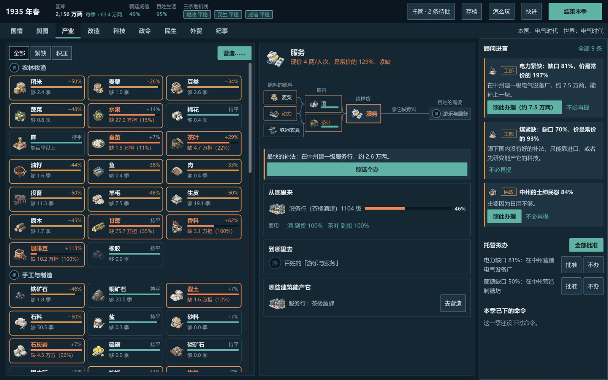

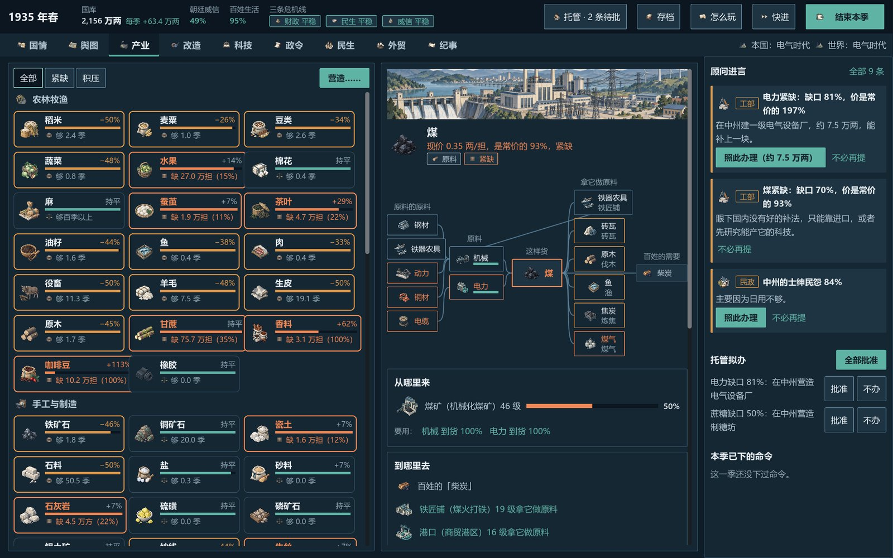

### 2.8 图片：第七批已接入

[docs/60](60_asset_requests_v7.md) 把新界面用得上的图全列了，「宁滥勿缺」，共 **354 张**。Codex 全部画好，又按你的意思统一了尺寸和留边。我做了三件事。

**检查**（逐张量过 Codex 交付的成品）

- 354 张尺寸都和清单要求一致；247 张透明图最外一圈全透明，四边留白都在 8% 以上；107 张场景画全不透明。
- 界面会读的 261 个路径全在 Codex 的清单里，一个不差。人物按你定的简洁几何画风；电气时代的士绅已经改成戴眼镜、穿白大褂的专业人士，和穿西装的商贾分得开了。
- 放进游戏后逐页截图核对：150% 与 200% 界面，开局、1730、1935 三个时间点。

**接入**

- 354 张图和 4 个时代框原样复制到游戏路径（和审核目录里的成品逐字节相同）；导入时打开多级纹理，小图标缩到二三十像素也不起锯齿。
- 补齐的 20 张建筑图写进内容表：水田、铜矿、瓷土采场、砂场、织布坊、缫丝坊、锯木坊、车马行补上工业期和现代期，织绸坊、水力动力坊、服务行补上早期，蒸汽动力站补上现代期。
- 内容指纹（存档靠它判断内容有没有改过）从此不算配图：以后换图、补图都不会让旧存档要重放。这一次指纹变了一回，两个审阅存档已重新生成，局面和原来一样。

**用在哪里**（除了前面几节说的科技、政令、民生、国史、产业）

- 九个页签各有小图标；顶栏按钮（托管、存档、怎么玩、快进、结束本季）在宽窗口带图标，窄窗口自动去掉；时代那一行配本国、世界各自时代的小图标；三条危机线配各自的图标，「国情」的危机卡再加阶段徽章（阶段文字照写，不只靠颜色）。
- 「国情」六个大数各配图标，人口、产值、国库的变化配涨跌箭头；季报的四个大数也一样。
- 舆图的地区卡、地区详情和民心地图的行头配地区小图标。
- 外贸「他们要买 / 他们要卖」配出港、进港小图标；右栏「撤回」配图标。
- 354 张里只有「收支平衡秤」一张没用上，眼下没有合适的位置。服务行的早期图写进了内容表，但服务行要到蒸汽时代才能建，正常玩看不到。

---

## 3 前两轮的七条意见（回顾）

### 3.1 地区地图 → 新「舆图」

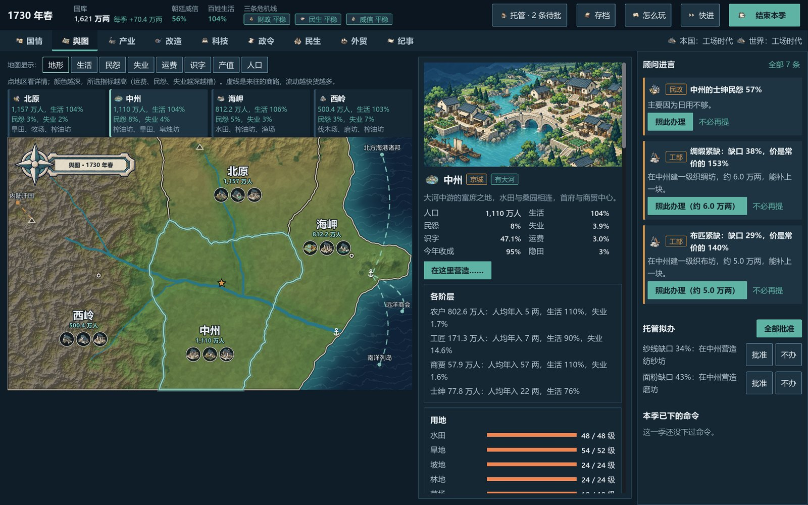

- **底图**：程序绘制的着色地形，有山地晕渲、林地、田块、河流、海面波纹；地区边界深底浅线，京城星标、城镇、港口锚、关隘。
- **左上角**：Codex 画的罗盘题名框，框里写「舆图 · 年份季节」。
- **地区上**：地区名、人口，下面三个圆形小图是当地前三样主要产业；有事时画警示三角。
- **航线**：海路、陆路伙伴的贸易线，虚线流动，越快表示货走得越多。
- **八个图层**：地形、生活、民怨、失业、运费、识字、产值、人口，按图层给地区着色，颜色越深这项越突出。
- **上方**四地区对比卡；**右侧**地区详情：场景画、人口与生活、各阶层人均收入、用地、建筑与开工率，每处建筑可以改造、封存、拆一级；悬停地区出卡片。国情页也有一张小舆图。

### 3.2 用语 → 白话

- v2 界面的全部中文都放在文案表里（`ui/text/zh_cn/jc_*.json`，约 1,080 条），界面代码里不写中文（有测试拦着），改字不用动代码。
- 照 docs/57 §14 写成对人说话的句子：金额「万两 / 亿两」，比例「12.5%」，时间「1 年 2 季」，价格「持平 / +30% / −20%」；不出现规则编号、变量名、ppm 这类写法；按钮写动作（「照此办理」「全部改造」「先改 13 级」）。
- 旧版界面清理了两轮（「证据 · 先核查」→「先看这几项」等，共约 190 处）。
- 截图审出来、改掉的会让人看糊涂的数：缺口最多写到 100%（原来会写「缺口 1,865%」）；改造回报为负时直说「眼下改了反而亏」（原来写「一年回报 −379%」）；存货够一百季以上写「够百季以上」（原来会出现「够 1,629,513 季」）；民怨建议只在跟失业有关时才提失业率。

### 3.3 原料与工业品体系、时代改造

**货与产业链**：85 样货，按农林牧渔、手工与制造、能源、服务分组，每样有单位、常价、时代区间和每季损耗。四个时代的主要链（细目见 docs/57 §4.2）：

- **农商**：口粮（稻、麦、豆）、棉布（棉 → 纱 → 布）、丝绸（桑 → 茧 → 丝 → 绸）、麻与船具、铁（矿＋木炭 → 生铁 → 铁器农具）、铜、瓷、木（原木 → 木炭、板材 → 家具）、油与烛、酒、纸与书、牧（役畜、肉、皮、毛）、盐、鱼、茶……
- **工场与商路**：甘蔗 → 蔗糖、水力纺织、煤代木炭、玻璃、面粉、远洋货（香料、咖啡）、钱庄、运河；木材开始枯竭。
- **蒸汽与铁路**：焦炭、钢、机械、钢轨、水泥、化学品与化肥、罐头、面包、啤酒、成衣、煤气、动力、铁路；服务（茶楼酒肆：越富越多买、几乎全靠人手，乡下闲人有了进城的出路）。
- **电气与现代**：电力、燃料油、塑料、铝、电缆与电机、电子、收音机电视机计算机、家电、汽车、药品。

**软约束**：哪里都能建，但缺料、缺人、缺地时，营造窗里用黄字写明预计开工率和原因；土地是硬上限。

**改造中心**（「改造」页）：时代往前走，旧做法每年掉一点效率（最多一成半）。

- **按类型一起改**：同类旧作坊一键「全部改造」，写明共几处几级、要多少钱、一年回报多少；回报高于 15% 标「划算」，回报为负标「会亏」。
- **合并改造**：同一地区的几处旧作坊合成一处新的，官府出钱，打七折。
- **逐处改造**：「整处改造」或「先改 N 级」，改造期间照常开工，只少产四分之一。
- **封存**一直亏本的官办（不发工钱、不耗原料，以后能重开）。
- 托管与民间都是一处处慢慢改：同类同时在改的不超过四分之一，失业多的地方先缓一缓省人工的改造。

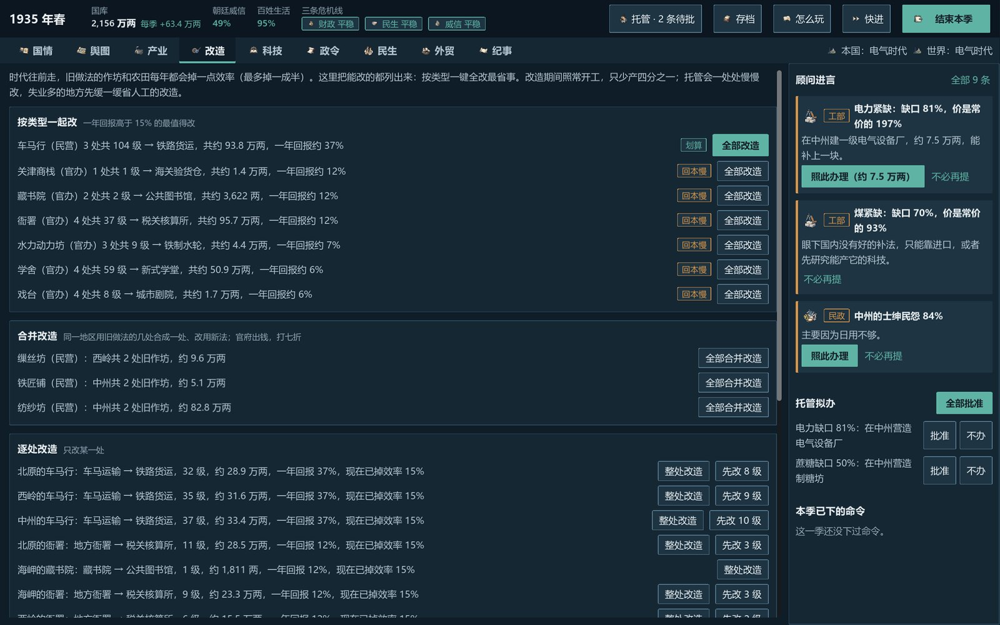

### 3.4 轻托管

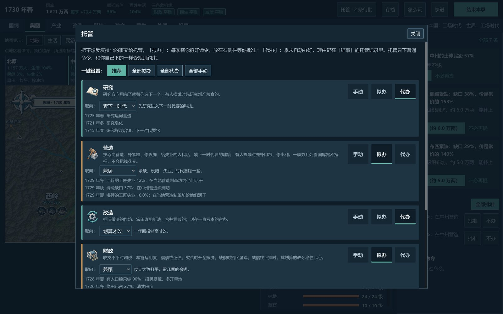

**六个领域**，每个都可以「手动 / 拟办 / 代办」，再选一个取向：

| 领域 | 托管做什么 | 取向 |
|---|---|---|
| 研究 | 研究方向用完了就替你选下一个；有人挨饿、或口粮涨价过一成时，先研究增产的 | 奔下一时代、兼顾、重农、重工、重商、重文教 |
| 营造 | 补紧缺、修设施、给失业的人找活、凑下一时代要的建筑；有人挨饿时先补口粮、修水利；一季办几处看国库宽不宽，不会把钱花光 | 兼顾、先补紧缺、先顾民生、求增长、奔下一时代 |
| 改造 | 旧做法的作坊、农田改用新法；合并零散的；封存一直亏本的官办 | 划算才改、能改就改、稳妥少改 |
| 财政 | 收支不平时调税、减宫廷用度、借债或还债；灾荒时开仓赈济，缺粮时招民垦荒；威信往下掉时，挑划算的政令稳住民心 | 兼顾、稳健、轻徭薄赋 |
| 外贸 | 签划算的商约、调关税、决定海禁还是开海 | 兼顾、开放、保护本国 |
| 事件 | 事件来了按取向替你选一项 | 先顾百姓、省钱、求增长 |

- **一键设置**：推荐 / 全部拟办 / 全部代办 / 全部手动。
- **拟办**的命令放在右侧栏，逐条批准或驳回；**代办**的每件事连同理由写进「纪事」→「托管记录」，季报里也会列出「托管替你办了几件事」。
- 托管和顾问读同一份分析（缺口、回本、民生、财政还能撑几季），顾问说的就是托管会做的；有预算上限、冷却期，一季只办有限的几件；只下普通命令，和你自己下的一样受规则约束，不会作弊。

### 3.5 顾问

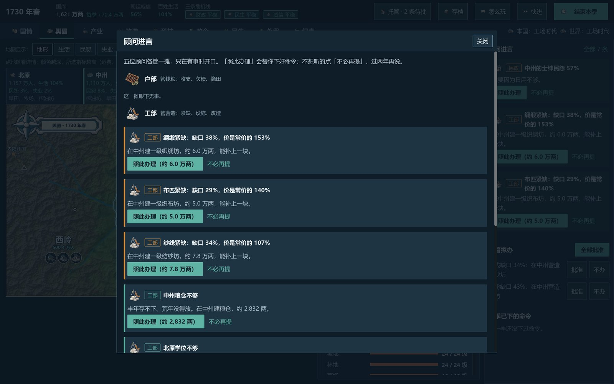

- 五部各管一摊，只在有事时开口：**户部**（收支、欠债、隐田、国库银子闲着）、**工部**（紧缺、设施、改造、积压）、**学政**（研究方向、下一时代还差什么、识字）、**民政**（缺粮、民怨、失业；威信不到五成时推荐最划算的拉民心政令）、**市舶**（港口与商路的能力、商约、世界已经走到前面）。
- 右侧栏只显示最要紧的三条，每条前有部门徽记；「全部」看完整列表。
- 每条都写缘由和数字，例如「铜材紧缺：缺口 60%，价是常价的 111%——在中州建一级炼铜作坊，约 4.8 万两」。「照此办理」一键下好命令，「不必再提」两年内不再重复。

### 3.6 可玩性与界面

- **开局就有真实数字**：新局先静默结算一季，1600 年春第一屏就是真实的产销、物价与统计。
- **季报**：平常季度只在底部提示一行；有大事才弹季报（快进时把几季合在一起，写明为什么停下）。
- **营造窗**：按农田、矿场、作坊、设施、公共分组；推荐回报最好的做法（带 ★）；逐地区写造价、工期、回报和要注意的地方。
- **时代**：「时代与地标」总览；进入新时代弹章节画，写明「这一时代带来什么」，一键去改造；世界进入新时代也有提示。
- **撤回**：本季下的命令都能撤回（Ctrl+Z）。**帮助**：「怎么玩」八段白话。F11 切换全屏与窗口，「存档」里有「退出游戏」。

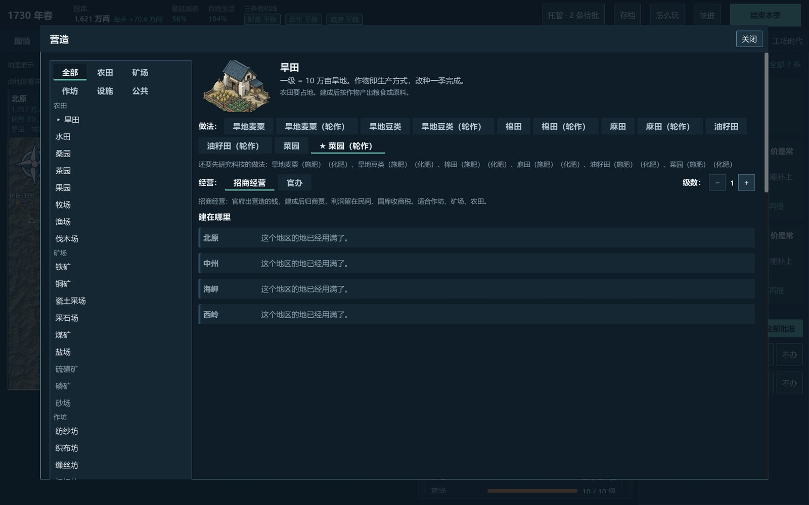

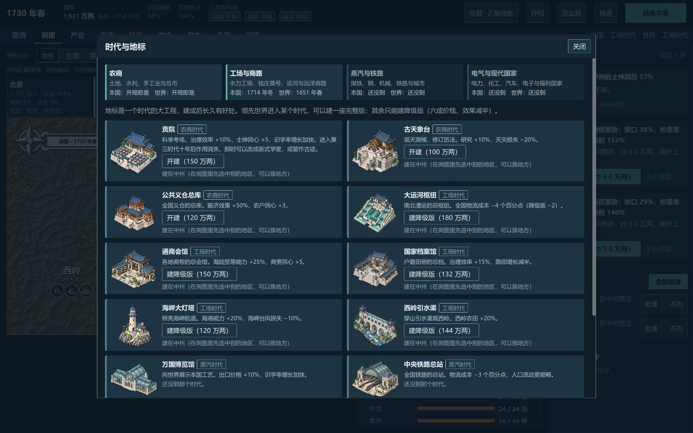

### 3.7 图片资源（第三至第七批）

| 用在哪 | 图 |
|---|---|
| 产业页、营造窗 | 85 样货的物资图；82 种建筑，按时代分早期 / 工业期 / 现代期三档（共 205 张不同的图） |
| 舆图悬停卡、地区详情 | 4 个地区 × 不同时代与境况的场景画 |
| 外贸页 | 6 个伙伴徽记 |
| 时代与地标 | 4 张时代章节画、18 座地标 |
| 事件窗、国史 | 31 种事件的事件画 |
| 顾问、托管 | 5 个部门徽记、6 个领域图标 |
| 舆图 | 罗盘题名框 |

第七批 354 张见 §2.8。第三至第七批（约 860 张）都在本机、都已接进游戏，但**还没提交进仓库**（见 §8）。

---

## 4 玩法与规则要点（审阅时对照）

**一季里发生什么**：你下命令（营造、改造、定研究、调税、下政令、签商约……命令立刻生效，这一季之内都能撤回）→ 结束本季：托管代办的事先办 → 年成与灾害 → 生产与买卖 → 各家收支 → 人口生死与流动 → 民怨、民心、威信 → 危机线 → 研究与时代 → 季报。

**市场**：全国一个市场，地区之间靠运费区分；价格随供求慢慢涨跌，有进口时不高于进口价、有出口时不低于出口价。同一季里原料先产、成品后产；缺料只让那一处少开工；**电这种存不住的能源排在最前面产**（这一轮改的，见 §6）。

**用工**：四个阶层各在本地区找活；口粮田（稻、麦、豆）先用人，剩下的人再按比例分给别的营生。阶层会慢慢流动：作坊缺人、村里有闲人，农户进城当工匠；读书的人多了，士绅变多；商业兴旺，工匠转商贾。到电气时代，上学的年头变长、有了养老，出来干活的人占比在 25 年里降 15%。

**钱往哪去**：作坊和商铺的利润归商贾；农田的地租归士绅、其余归农户；官营的归国库。民间的闲钱（商贾、士绅的积蓄）按回报自己投资新建与改造，这笔钱从积蓄里出，不压日常开支。

**百姓的日子**：每个阶层有一份需要清单：口粮、盐、衣、柴炭、蔬果、鱼肉、油、器用、灯火、医药、家具、茶、酒、纸墨、书籍、丝绸、瓷器；第二时代加糖、皂、香料，第三时代加游乐与服务，第四时代加用电、家电、出行。「生活」= 六成看温饱（口粮、盐）＋ 四成看日用（跟这个时代应有的水平比）。**期望一半看外国、一半看本国**：世界进了新时代、本国也进了新时代，期望都会在四十年里慢慢涨上去；落后于世界，日子就显得紧。

**民怨、民心、威信**：日子不如期待、税比开局重、欠饷、失业都会加民怨；民怨拉低各阶层的民心，政令也会加减民心；四个阶层的民心按分量（农户三成、工匠一成半、商贾两成、士绅三成半）合成朝廷威信，再减去落后于世界的差距、加上国望。

**三条危机线**：财政（欠发俸饷，或欠债超过三年收入）、民生（最乱地区的民怨、最饿地区的口粮）、朝廷威信（45% 以下吃紧、35% 以下危急、25% 以下崩溃在即）。任何一条在「崩溃在即」停满八季，这一局结束。

**财政**：收入是田赋、盐课、商税、关税和官营利润；支出是官俸、军饷、办学、医药、工程养护、赈济、宫廷用度、利息和官办营造，每项拨款 0—150%。隐田每年侵蚀在册田亩，清丈能追回七成，但得罪士绅。缺钱可以向商贾借债，利息一直要付。

**政令**（27 道，分六类）：开关类随时可停，运动类一次发起、持续几季，分档的（海禁与开海、农商取向、盐政、铁路、劳工）选一档。

- 能拉民心、托管和顾问会推荐的：兴学、常平仓、一条鞭法、茶马互市、钱庄准入、工场特许、官刻书局、航海条例、工厂法、义务教育、中央银行、社会保险、环境法等；
- 有得有失、留给你权衡的：所得税、遣使译书、捐纳、征发徭役、海禁与开海、农商取向、盐政、劳工。
- 施政的总体样子在「政治改革」页签的「当今国家」里看（§10.2）。

**政体与政局**：10 种政体，只能推行改革局势（几年推完，两个关口）或在革命、战败、天下大乱里改变；蒸汽时代起有革命压力、列强压力和偶发的经济危机（§10.1，数值见 docs/61）。

**研究与时代**：49 项科技分属四个时代；研究点来自士绅、商贾、识字的工匠和学舍书院。国内相关产业越发达、外国已经会的，研究越快（只加速、不硬锁）。进入下一时代要几项关键科技 ＋ 几类标志建筑 ＋ 一项社会条件（识字或城镇人口）。领先世界进入新时代，可以建完整版地标，出口有加成。

**外贸**：6 个伙伴（北方海港诸邦、南洋列岛、内陆汗国、远洋商会、新兴工业国、联盟集团），各有要买要卖的货、自己的发展进度和交情；海路受港口能力约束，陆路受商路能力约束。你的手段：开海或海禁、关税、签商约、遣使译书。

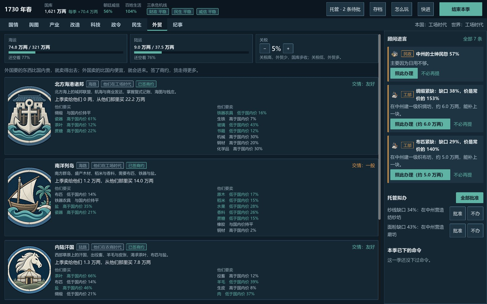

**人口**：吃饱时慢慢增长；口粮不到九成五，出生减少、死亡上升；死亡率随时代下降（工场、蒸汽、电气时代逐级），识字的人多了少生只从电气时代起（§10.4）。

**国史**：大事另记一份，存档里一直留着（§2.6）。

---

## 5 平衡与节奏

（这一轮用最终的内容重跑：`tools/v2_play.gd`，8 个随机种子。`passive.json` 是什么都不管；`steward_balanced.json` 是六个领域全部代办，事件取向「先顾百姓」。逐局的政局大事见 [docs/61](61_politics_and_late_economy.md) §7。）

**什么都不管**

| 种子 | 1 | 2 | 3 | 4 | 5 | 6 | 7 | 8 |
|---|---|---|---|---|---|---|---|---|
| 亡国年份 | 1686 | 1689 | 1689 | 1672 | 1686 | 1688 | 1698 | 1698 |
| 原因 | 威信 | 国库破产 | 威信 | 威信 | 威信 | 威信 | 国库破产 | 威信 |

一般的路径是：隐田越来越多、田赋收不上来；世界进了工场时代，本国原地不动，百姓越来越嫌日子紧；国库见底后欠饷，威信一路往下。亡国前至少两年有顾问警示和危机进度。政局从蒸汽时代才起作用，不改变无操作局的走向。

**全交给托管**：8 局都走到 2000 年。

| 种子 | 进入工场 / 蒸汽 / 电气时代 | 政体 | 1999 年人口 | 城镇失业 | 生活 | 威信 | 一路最低威信 |
|---|---|---|---|---|---|---|---|
| 1 | 1686 / 1801 / 1907 | 开明 1689 → 立宪 1879 → 共和 1884 | 6,113 万 | 9.8% | 85% | 48% | 36%（1854） |
| 2 | 1691 / 1808 / 1915 | 开明 1694 → 立宪 1918 → 共和 1923 | 5,878 万 | 12.7% | 91% | 48% | 42%（1914） |
| 3 | 1698 / 1799 / 1895 | 开明 1701 → 立宪 1898 → 共和 1902（1917 年兵变被收买平息） | 6,161 万 | 10.4% | 89% | 45% | 39%（1914） |
| 4 | 1696 / 1828 / 1898 | 开明 1698 → 立宪 1901 → 共和 1906 | 6,287 万 | 9.1% | 89% | 49% | 40%（1894） |
| 5 | 1715 / 1812 / 1914 | 开明 1718 → 立宪 1886 → 共和 1890 | 5,578 万 | 8.0% | 91% | 50% | 39%（1874） |
| 6 | 1686 / 1794 / 1909 | 开明 1689 → 立宪 1913 → 共和 1917 | 5,619 万 | 9.4% | 90% | 49% | 40%（1864） |
| 7 | 1686 / 1808 / 1903 | 开明 1689 → 立宪 1906 → 共和 1911 | 5,651 万 | 9.1% | 88% | 47% | 42%（1914） |
| 8 | 1689 / 1799 / 1911 | 开明 1691 → 立宪 1914 → 共和 1918 | 6,109 万 | 7.2% | 89% | 47% | 38%（1939） |

世界进入各时代：第二时代 1651—1663 年，第三时代 1757—1778 年，第四时代 1843—1866 年。每局有一到两次列强叩关（托管都选「变法图强」）、两到六次经济危机（都选「以工代赈」）。

和第三版比：二十世纪人口不再下降（8 局一路涨到 2000 年，最大回落 2%—8%），失业不再是「三成人没活干」（城镇失业约一成，其余是农村富余劳力）；威信 45—50%（第三版 44—52%），生活 85—91%（第三版 90—95%，二十世纪的期待更高了，见 §10.3）。

**这对玩的人意味着什么**：

- 只靠托管能稳住，但不出彩：托管走的是「开明 → 立宪 → 共和」这条最稳的路，2000 年威信五成上下。
- 你亲自管的价值在：抢先研究、凑齐时代门槛；推哪项改革、关口怎么选、列强来了打还是和——商人共和、军政府、一党执政、社会主义这些路只有你会走出来，也可能在革命、战败里丢掉政体。

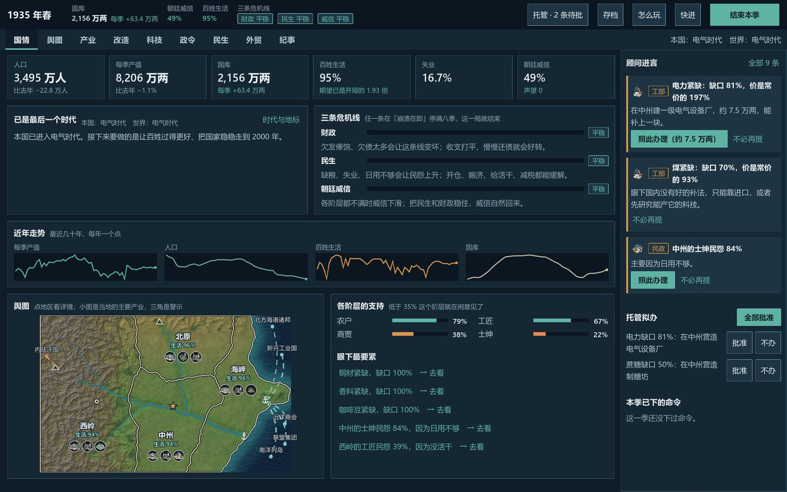

---

## 6 改动记录

**第四轮（10-01 晚，四条意见）**

- **政治改革**（第 1 条，§10.1）：十种政体；政体不能直接下令换；十二项改革局势（两个关口）；革命风潮、列强叩关与战争、不平等条约、保护国、经济危机与以工代赈；两种压力逐项写明来由；托管代选关口、政体落后时主动推改革；顾问提醒压力与关口；快进遇关口停下；回合结束弹「政局待决」；政令页分「政令与财政」「政治改革」两个页签；国史与纪事多了「政局」一类。
- **评语**（第 2 条，§10.2）：141 句，政体 × 风格 × 局面。
- **帮助**（第 3 条，§10.3）：「怎么玩」新增两段。
- **二十世纪的经济**（第 4 条，§10.4）：人口转型的次序、矿藏上限随时代提高、合成氨与合成化肥、电的销路、需求算上缺的原料、投资看原料到货与增长、机械化少省些人；城镇失业与农村富余劳力分开报。
- **测试**：新加 7 项（政体只能靠政局改、改革走完两个关口、革命与让步、议和与条约约束、以工代赈与守恒、存读档、政治改革页签与弹窗）；全部 645 项通过。审阅存档重新生成，新增 `review_1878`。

**第七批图片接入（10-01 傍晚）**

- 检查 Codex 的 354 张成品并接入游戏，20 张补齐的建筑图写进内容表（§2.8）。
- 新部件：科技徽章（底板 ＋ 主体 ＋ 时代框）；国史的卷轴页眉、年代题签框、分隔花纹。
- 情绪小脸套颜色圈；需要的图标在圈里放大一点；国史按主因配「大饥荒 / 民变四起」，领先世界、改政体各有配图；国情与季报的大数配图标，人口、产值、国库的变化配涨跌箭头。
- 内容指纹不再算配图，以后换图不会让存档要重放；两个审阅存档重新生成。
- 截图工具可以先把页面往下滚再截（`policy+900`）。
- 测试：新加「民生危机记下主因」；全部 638 项通过。

**这一轮（10-01 八条意见之后）**

- **界面**：界面大小（§2.1）；价格说法（§2.2）；科技树（§2.3）；政令页「当今国家」与政令卡（§2.4）；民生（§2.5）；国史（§2.6）；产业图卡（§2.7）。
- **新政令**：政体、劳工两道分档政令（§2.4），政令共 28 道。
- **电力与煤的死结**：同一季里原来按「原料先产、成品后产」排，电厂排在煤矿后面；可电存不住，煤矿那一刻没电就少产，电厂又缺煤——两边越转越少，电气时代电力缺口常年八九成。现在**存不住的能源先产**，煤矿拿得到电，这个死结解开了（§5 的数就是解开以后的）。后期原料仍然偏紧，见 §7。
- **联产品定价**：一个做法出两样货（皂烛兼营出蜡烛和肥皂、酿酒兼出啤酒、炼焦兼出煤气）时，原来副产品只分到很少的成本，常价下做它的都亏本，肥皂几百年都是 0%；现在按「整个做法照常赚钱」定价，肥皂、啤酒、煤气都有人做了。第一时代的货一样没动。
- **国史**：开局就记「新君即位」；事件写明选了哪一条；图没到时圆章里写有意思的字（钱庄写「钱」、盛世写「盛」，现在图都到了）。
- **小修**：读档后外贸页的海运、陆运能力显示成「0 两 / 0 两」，改成读上一季的结算；产业链图「到货」改成小条，不再被截成「到货 1(」；舆图图层按钮放不下时折行。
- **测试**：新加「开国一条」「国家形态评语」等测试；全部 637 项通过。

**上一轮（9-30 至 10-01）**

- 接入 Codex 第五、六批图片（44 张）。
- 种粮优先；民间出资从积蓄里出；期望一半看外国、一半看本国；电气时代劳动人口比例下降；服务业；口粮互相顶替；托管与顾问用政令拉民心；托管提前应对粮荒。
- 钱庄汇兑的造价提高（全托管进工场时代推迟到 1686—1722 年）；隐田增长加快（不操作的局早几年倒）。
- 旧版用语第二轮 147 处；截图审出的四处会让人看糊涂的数（§3.2）。
- F11、退出游戏、`play.bat`、审阅存档；诊断工具 `tools/v2_diag.gd` 的 `needs`、`support`。

---

## 7 已知问题（如实）

1. **后期原料仍然偏紧**：电与煤的死结解开了，但电气时代电力、煤、瓷土、生丝、甘蔗还是常缺（`review_1935` 里电力缺 81%、煤缺 70%），产业页一片橙。矿藏有上限，民间与托管补上游补得不够早。需要专门理一遍后期的原料链（开矿的科技、进口、托管更早补上游）。
2. **煤缺七成，价却只有常价的 93%**：进口价封顶、进口又受运力所限时，会出现「缺得多、价不高」，顾问的话读着矛盾。要么让价格在进口不够时继续涨，要么换个说法。
3. **后期商贾、士绅不满**：电气时代他们的民心常在两三成（农户七八成），威信因此停在五成上下。他们的收入跟不上期望（到电气时代，期望是开局的近两倍）。
4. **人口**：二十世纪不再下降了（§10.4），但蒸汽时代遇上饥荒的年代还会少几个百分点（`review_1878` 的国史里 1870 年代写着「人口减少 3%」，那是 1877 年的饥荒）。
5. **失业**：城镇失业 7—13%；农村富余劳力二十世纪常在一到两成（村里分一家的收成，民怨轻得多）。
6. **托管研究铁路太晚**：`review_1935` 那局 1926 年才掌握铁路、1927 年第一条铁路通车。托管按「时代要」的科技优先，铁路不在门槛上就一直往后排。
7. **托管修水利只修到覆盖五成**（顾问也只在不到五成时提）。可以放开，但粮食一多人口就涨，要连同失业一起调。
8. **图**：第七批补了 20 张建筑图后，水田、铜矿、织布坊等十来座有了各时代的形态，其余建筑大多仍只有一两种，别的时代借同类的通用图。顶栏危机标签里的小图标只有十几像素，只能看个轮廓（标签上都写着字）。354 张里「收支平衡秤」一张眼下没有合适的位置，没用上。
9. **读档后的头一季**，「收入从哪来」的彩条和原料到货率要结束一季后才有（这两样不存进档里）。
10. **还没做**：Windows 可执行文件（要下载约 1 GB 的导出模板，见 §8）；手绘舆图底图（可选，程序底图已能用）。
11. **政局的图**：新五种政体的徽记、12 项改革与 4 种局势的配图、11 张国史大卡、5 个小图标还没有，界面显示占位圆章（每种政体一个字）；清单见 [docs/62](62_asset_requests_v8.md)。
12. **托管的政体之路单一**：托管只在政体落后于时代、革命压力过四成时推改革，取向「先顾百姓」时 8 局都是「开明 → 立宪 → 共和」。别的路（商人共和、一党、社会主义……）要你自己推。
13. **共和国里的士绅**：议会共和下士绅民心常在一成上下，是共和国革命压力的主要来由；托管不会为他们专门做什么，压力满了会出一场士绅支持的兵变（8 局里一次，被收买平息）。

---

## 8 需要你决定的事

1. **提交图片**：Codex 第三至第七批的图（约 860 张；第七批成品约 250 MB）都已接进游戏、截图核对过，但按约定没有提交进仓库。GitHub 上的工程现在缺这些图（界面不报错，只显示占位或不显示）。你说一声，我就把这些图连同导入设置一起提交、推送；仓库是公开的，图也会跟着公开。审核入口：`docs/_drafts/asset_review/v5`—`v7` 各自的 `index.html`。
2. **打包 Windows 可执行文件**：需要下载 Godot 导出模板（约 1 GB）。要的话我再单独问你确认下载。
3. **第八批图片**：[docs/62](62_asset_requests_v8.md) 列了政治改革要的 47 张（新政体徽记 15、局势 4、改革 12、国史大卡 11、小图标 5）。你看过清单、同意的话交给 Codex。
4. **下一轮先做哪件**：后期原料链（§7 第 1、2 条）、后期商贾士绅（第 3 条）、托管的研究顺序（第 6 条）、托管要不要也走别的政体之路（第 12 条），或者你试玩后提的问题。

---

## 9 审阅清单（试玩时对照）

**这一轮（第四轮）**
- [ ] 「政治改革」页签一眼看出：当今政体、能推什么改革、眼下有什么局势、哪里要拿主意、压力从哪来。
- [ ] 改革推起来有分量：几年推完、两个关口的选择有得有失。
- [ ] 革命、列强、战争、经济危机来得有征兆（压力条、顾问），选项的后果说得清。
- [ ] 评语准、有意思；换了政体、碰上局面，称呼跟着变。
- [ ] 「怎么玩」里的生活、民心、威信讲明白了。
- [ ] 二十世纪：人口在涨，城镇失业一成上下，经济危机偶尔来、几年后复苏。

**第三轮**
- [ ] 默认字号合适；调到 175% / 200% 后各页不挤、字不被截。
- [ ] 价格说法都看得懂、不别扭。
- [ ] 科技树一眼看出先研究什么、研究了得到什么；拖动顺手。
- [ ] 「当今国家」的评语准；政体、劳工两道政令的效果与门槛合理。
- [ ] 民生页一眼看出谁过得好、谁不满、缺什么。
- [ ] 国史读着像一部国家的历史；「史官曰」、里程碑、年代评语合适。
- [ ] 产业图卡和链图比原来的表格直观。
- [ ] 第七批图片在游戏里的效果：科技徽章、几何画风的人物、政令配图、国家徽记、里程碑画、各种小图标。

**开局与上手**
- [ ] 开局窗口的说明读得懂；「推荐」与「全部自己来」的区别清楚。
- [ ] 第一季看完「国情」就知道该干什么；「怎么玩」帮助够用。

**托管、顾问、难度**
- [ ] 「推荐」设置下，你需要操心的事刚好；托管记录里的理由说得清。
- [ ] 顾问的话中肯、不啰嗦，「照此办理」办得对。
- [ ] 什么都不管时，危机来得看得见、有警示。
- [ ] 亲自经营前一两百年有事可做，有压力但不憋屈。
- [ ] 读 `review_1935` 看后期：问题看得明白，知道从哪下手。

---

## 10 第四轮：四条意见的答复与改动（10-01 晚）

### 10.1 政治体制与政治改革（第 1 条）

> 政治体制不够多样，而且 UI 按钮不该放在那个位置，应该放在法令专门的政治改革界面。要么靠主动推行一个改革局势，要么出现外部局势（比如境外势力入侵或者本国的革命压力）。

**按钮挪走了**：政令列表里不再有「政体」，也不能再下令直接换（命令会被拒，说「去政治改革推行改革」）。政令页分成两个页签：「政令与财政」顶上只留一行当今国家的评语，点「政治改革 →」过去。

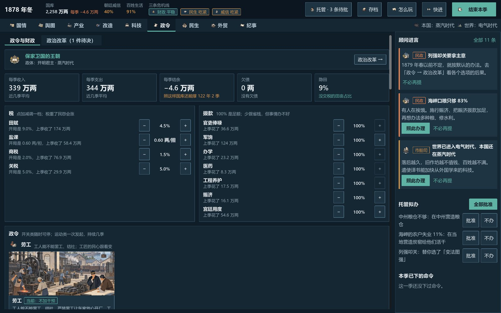

**政体从 5 种加到 10 种**：君主集权、开明君主、君主立宪、议会共和、社会主义，加上商人共和（商贾掌国）、军政府、军阀割据（中央号令不出京城，税收不上来）、一党执政、保护国（战败后受列强控制）。每种都有效果和各阶层的好恶，鼠标停在「各种政体」的徽记上能看到。

**主动：改革局势**。12 项改革各从某几种政体出发、通向一种政体（开明改革、商人议政、立宪运动、共和改制、还政于民、君主复辟、统一全国、收回主权、社会主义改造、一党建国、市场化改革、民主化）。推行要开办费和每季的花费，几年才推完；推得快慢看拥护与反对的阶层民心（拥护的民心高、反对的低就快）。推到 35% 是「反对声浪」：强推、让步还是花钱疏通；推到 70% 是「临门一脚」：一鼓作气、稳扎稳打还是放慢。威信跌破两成，改革就失败。

**被动：外部局势**。

- **革命风潮**：本国进入蒸汽时代后，威信低、某个阶层被逼急、城里失业多、政体落后于时代、苛政，都会累积革命压力；满了就爆发革命——出兵镇压、顺应民意（立刻改政体）、收买安抚，或者静观其变。革命成功就换政体，天下大乱时成了军阀割据；欠饷、军饷不足时是兵变，成了军政府。
- **列强叩关**：世界进入蒸汽时代后，本国落后、兵弱、闭关会累积列强压力；满了列强兵临城下——抵抗（开战，比兵力与技术）、议和（赔款、签二十年不平等条约：关税不过 2%、不能闭关）、变法图强（花钱，压力降六成，研究加快）。战败可能沦为保护国，之后可推「收回主权」。
- **经济危机**：蒸汽时代起偶尔爆发，经济过热时更容易；居民只买必需品、民间不敢投资。放任出清最省钱但最痛；以工代赈由国库出钱办公共工程雇失业的人；保护关税让本国货少受冲击。

两种压力都在页签里逐项写明来由（「威信低 +0.6%」「士绅民心低落 +0.5%」「落后于世界 +1.0%」「日久平息 −0.8%」……），顾问在压力过半时提醒。

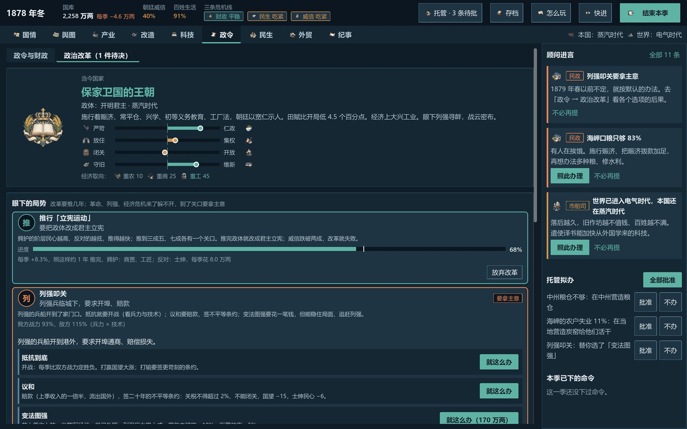

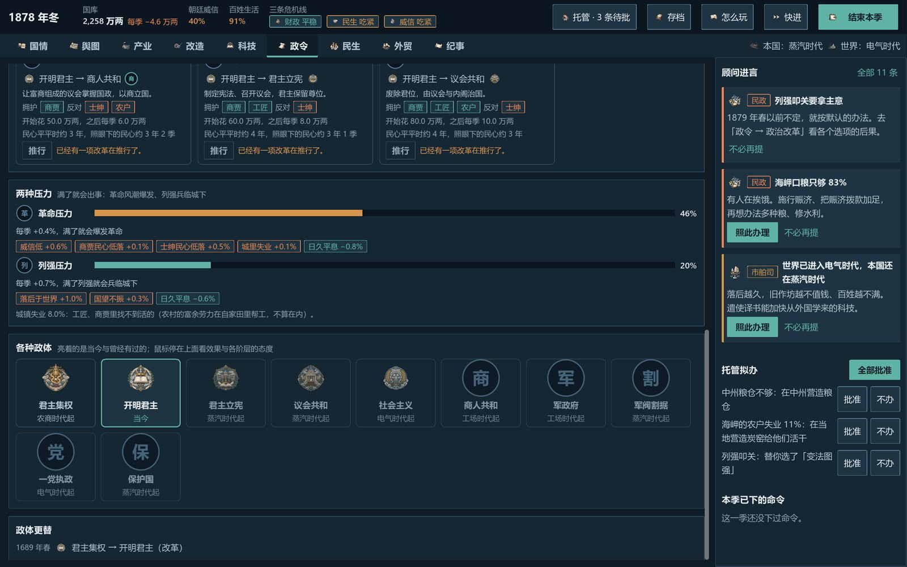

结束一季时有关口待决（事件不是交给托管代办时），会弹出「政局待决」；可以先关掉，到页签里再定，截止前不定就按默认的那项办。托管代办事件时会替你选，还会在政体落后于时代时主动推改革。

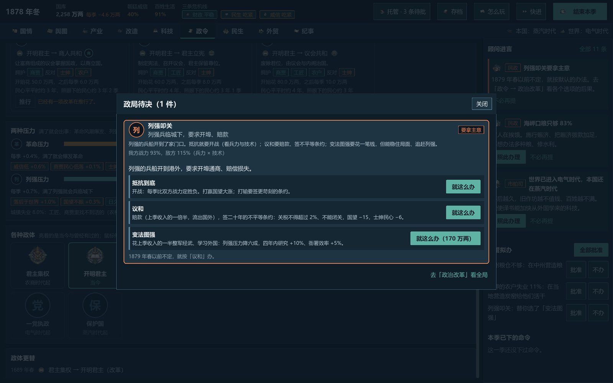

1935 年的议会共和：评语「工业共和国」，可以推君主复辟、社会主义改造、一党建国；政体更替列着这一路怎么来的。

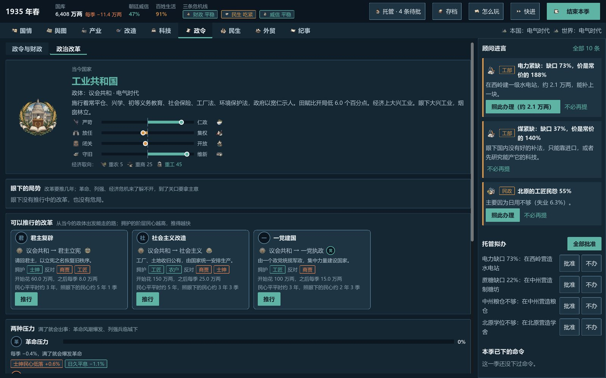

完整的数值（各政体效果、改革表、关口、压力的每一项、战争与条约）见 [docs/61](61_politics_and_late_economy.md) §1—§5。

### 10.2 国体评语的称呼（第 2 条）

**以前一共 18 句**：五种政体各三句（宽厚 / 持重 / 严苛）——宽容仁厚的帝国、守成持重的帝国、严刑峻法的帝国；开明仁厚的王朝、开明务实的王朝、开明其表严苛其里的王朝；温和宽厚的立宪王国、稳健的立宪王国、铁腕的立宪王国；安康的共和国、务实的共和国、冷酷的共和国；福利的工人国家、工人的国家、堕落的工人国家（社会主义严禁罢工时一定是这句）——再加闭关自守的农本帝国、通商四海的帝国、商人的共和国三句特例。

**现在 141 句**，分三层，取最贴切的那句：

1. **政体 × 局面**（78 句）：先看眼下的局面——危亡、战事、革命、萧条、盛世、落后、穷兵、闭关、通商、工业、农本——再配上政体。例如：日薄西山的帝国、四海升平的天朝、老大帝国、兴办洋务的帝国、帝制的黄昏；开明盛世、开明专制的工业王朝；工业立宪王国、宪政危机中的王国；工业共和国、战时共和国、大萧条中的共和国、福利共和国；举国工业化的工人国家、工人的乐园、战时共产主义、短缺经济中的工人国家；海上商业共和国、黄金时代的商人共和国、资本的共和国；开发独裁的军政府、富国强兵的军政府、兵变阴云下的军政府；群雄逐鹿、军阀混战的乱世、租界林立的割据之国；举国体制的党治国家、铁幕之后的党治国家、改革开放的党治国家；列强的商埠、外资工厂林立的保护国、种植园之国。
2. **局面 × 施政风格**（33 句，配上政体的称呼）：保家卫国的王朝、风雨飘摇的帝国、革命前夜的共和国、共克时艰的立宪王国、富而不仁的商人共和国、穷兵黩武的军政府、血汗工厂里的党治国家……十种政体都能配，合起来三百多种说法。
3. **政体 × 施政风格**（30 句）：没有特别的局面时用，例如有所节制的军政府、整肃秩序的军政府、铁血的军政府；尚得喘息的保护国、仰人鼻息的保护国、任人宰割的保护国。

局面怎么定：威信不到三成或有危机到了「危急」是危亡；列强叩关或开战是战事；有革命、有经济危机各算一种；生活过百、威信过六成五、没有危机是盛世；世界进了蒸汽时代、本国还落后是落后；军饷一倍三以上是穷兵；海禁是闭关；对外开放又重商是通商；第三时代起重工是工业；重农是农本。评语下面另有一句写明眼下的局面（「眼下列强寻衅，战云密布」）。

### 10.3 民心和生活是怎么算的（第 3 条）

**生活**（各地区、各阶层一个数，国情页显示全国平均）

- 生活 = 六成「温饱」+ 四成「日用」。温饱是口粮和盐满足了几成；日用是日用品（布、柴炭、糖、皂、上馆子、用电、家电、出行……）比起「当世的期待」有多少，最多算到 125%。吃不饱的时候（温饱不到 95%），日用再好也只按温饱算。所以生活最高 110%。
- **期待**一半看世界、一半看本国的时代，进新时代后四十年里逐步涨上去：农商时代是开局的 1 倍，工场 1.3 倍，蒸汽 1.7 倍，电气 2.3 倍。国家原地不动、世界往前走，日子就显得越来越紧——国情页「百姓生活」下面写着「期望已是开局的几倍」。
- **多少算高**：95% 以上过得好（绿），85%—95% 有点紧（黄），85% 以下就紧了（红）。

**民怨**（各地区、各阶层）

- 目标值 = 3 ×（95% − 生活）＋ 税比开局重的部分（农户看田赋与盐课，商贾看商税，士绅看田赋）＋ 欠饷欠俸（农户、士绅 +15%）＋ 没活干的人占比（城里的工匠商贾 × 1.5，村里的农户 × 0.5）− 6%；集市、戏园这类设施最多再减一成，政令和事件的修正另算。民怨每季最多变两成。

**民心**（四个阶层各一个数）

- 目标值 = 60% ＋ 施行中的政令与政体对这个阶层的好恶（每点 1%）＋ 限时的加减 − 这个阶层平均民怨的六成 ＋ 国望（每点 0.1%）。每季最多变一成五。
- **分档**（民生页的小脸）：民心七成以上且民怨一成以下是「安居乐业」；五成五以上且民怨两成五以下「过得不错」；四成以上「还算安稳」；两成五以上「颇有怨言」；更低「群情激愤」。低于 35% 这个阶层就在闹意见了。

**朝廷威信**

- 威信 = 四个阶层民心的加权（农户 30%、工匠 15%、商贾 20%、士绅 35%）− 连续欠饷（每季 2%，最多 20%）− 落后于世界（每差一个时代 3%）＋ 国望（每点 0.1%）。
- 低于 45% 危机线「吃紧」，35%「危急」，25%「崩溃在即」；停在崩溃在即八季，这一局结束。

**怎么提高**

1. 粮、盐先够吃：水利、粮仓、常平仓、赈济——温饱占生活的六成。
2. 日用品多而便宜：补上紧缺的货（产业页「缺口」）、修路降运费、集市够用；时代往前走，新东西（糖、皂、电、家电）才买得到。
3. 给人找活干：城里失业对民怨的影响是村里的三倍。
4. 税别比开局重太多；俸饷按时发（欠饷同时伤民心和威信）。
5. 多建设施（集市、戏园、学舍、医馆）。
6. 施行各阶层喜欢的政令（政令卡上写着对谁加减几点）；政体本身也有好恶。
7. 赶上世界的时代：落后一个时代威信就少 3%，期待还会被外国拉高。

这些现在也写进了游戏里「怎么玩」的「生活、民怨、民心、威信」一段。

### 10.4 二十世纪的大失业与人口下降（第 4 条）

> 为什么每次到 20 世纪及以后总是出现大失业和人口下降？按照历史那段时代反而是因为合成氨等发明人口爆炸增长且就业岗位也爆炸增长的啊，直到短期经济危机爆发才出现出清和停滞以及生活水平下降的。

你说得对，是模型错了。一项项查下来，有八个原因：

1. **人口转型的次序反了**：识字一高出生率就降（从工场、蒸汽时代就开始），死亡率却要到电气时代才降——人口先掉后涨，和历史相反。
2. **煤被矿藏卡死**：矿藏按开局的储量封顶，蒸汽、电气时代的深井技术不提高上限；煤矿还缺人。
3. **没有合成氨**：化肥只有「磷肥」一种做法，磷矿有限，二十世纪粮食上不去。
4. **电的销路算错**：用电的工业看不到电的需求，一直建不起来。
5. **需求只算买到的、没算缺的**：原料到不了货，价格不涨、投资也看不见。
6. **投资盲目**：原料到不了的厂照样有人建，建了开不了工。
7. **机械化一下子把村里掏空**：机械化种田只留三成人手。
8. **民间投资只看眼前的销路**：闲人很多时也不敢先建厂（建了招人，工钱才会变成销路）。

**改法**：死亡率随时代下降、出生率到电气时代才随识字下降（五十年到位）；矿藏上限随蒸汽、电气时代的普及提高（煤铁等 +60% / +90%，石油 +150%），矿山少用人；新增「合成氨」（煤 + 电）与「合成化肥」（燃油 + 电，不要磷），机械化种田另加两成收成；电的销路只为居民必需的那部分留量；需求与价格算上缺的原料；投资回报乘原料到货率；机械化留四成人手；蒸汽时代起闲人多时民间敢多看一点销路，招工时村里的闲人也算可招的人手。

**失业分开报**：国情页的「城镇失业」只算工匠、商贾里找不到活的（约一成）；「农村富余劳力」单列在下面——村里闲着的农户分的是一家的收成，民怨只有城里失业的三分之一。原来把两者混成一个「失业」，二十世纪看着有三成人没活干，大半其实是村里的富余劳力。

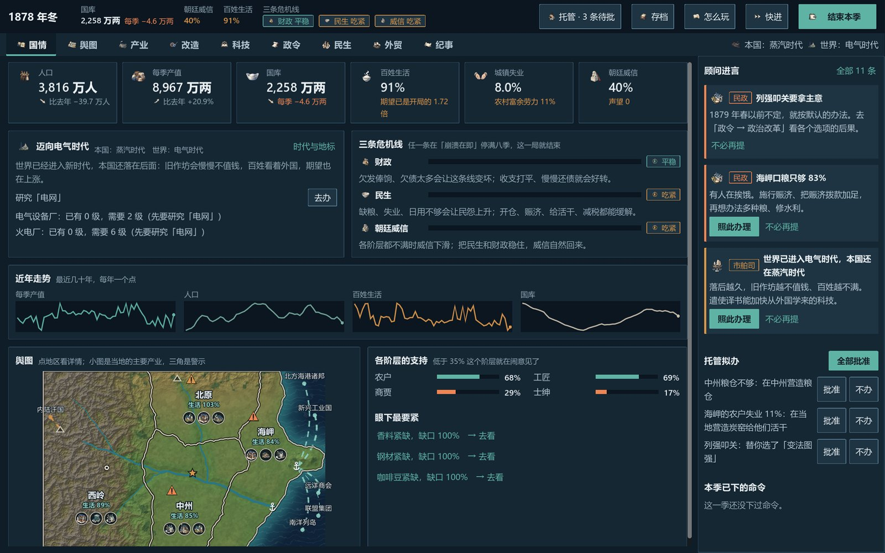

**经济危机现在是短期的**：蒸汽时代起偶尔来一次（过热时更容易），居民只买必需品、投资缩水，一年半到两年半后复苏——就是你说的「出清和停滞」；以工代赈能让它轻一些（§10.1）。

**结果**（8 局 1999 年的平均）：

| | 人口 | 产值（万两） | 失业（全部） | 城镇失业 | 生活 | 威信 |
|---|---|---|---|---|---|---|
| 改之前（第三版） | 3,194 万 | 8,662 | 13.7% | — | 93% | 49% |
| 第 4 条改完、还没有政局 | 6,570 万 | 16,724 | 29.3% | — | 85% | 42% |
| 现在（加上政局） | 5,924 万 | 16,457 | 20.0% | 9.5% | 89% | 48% |

人口翻了将近一倍、产值翻了将近一倍，8 局二十世纪人口都是一路涨到 2000 年。生活比第三版低几个点，是因为人多了、电气时代的期待又高（2.3 倍）；威信回到五成上下。

---

## 附录 A 文件与命令

| 内容 | 位置 |
|---|---|
| 试玩 | `play.bat`（工程根目录） |
| 设计规格 | `docs/57_campaign_v2_design.md` |
| 落地记录 | `docs/58_campaign_v2_status.md`（§9 是后两轮） |
| 第七批图片需求 | `docs/60_asset_requests_v7.md` |
| 政治改革与二十世纪经济 | `docs/61_politics_and_late_economy.md` |
| 第八批图片需求（政局） | `docs/62_asset_requests_v8.md` |
| 本文截图 | `docs/59_shots/`（除注明 200% 的两张外，都是 150% 界面、2560×1600 窗口） |
| 界面文案 | `ui/text/zh_cn/jc_ui.json`、`jc_overlays.json`、`jc_engine.json` |
| 内容表 | `content_v2/*.json`（由 `python tools/content_v2/build.py` 生成） |
| 模拟核心、应用层、界面 | `campaign/core`、`campaign/app`、`ui/campaign`（新部件在 `ui/campaign/widgets/`：科技树、科技徽章、时间轴、图标环、取向刻度、占位圆章） |
| 新一批图的预览 | 图还在审核目录、没放进游戏路径时，命令行加 `--jc-art-preview=<清单路径>`（如 `docs/_drafts/asset_review/v7/additions_manifest.json`）就能在游戏里直接看；只读，不搬文件 |
| 审阅用存档 | Godot 用户目录下 `jc_saves/review_1730.json`、`review_1878.json`、`review_1935.json`（游戏里「存档」能看到） |

验证（在工程根目录用 Git Bash）：

- 全部测试：`bash tools/test.sh`
- 脚本解析：`bash tools/check.sh`
- 跑一局看数：`godot --headless --path . --script res://tools/v2_play.gd -- res://tools/playscripts_v2/steward_balanced.json seed=1 until=2000 every=40`
- 拆生活与收入：`godot --headless --path . --script res://tools/v2_diag.gd -- res://tools/playscripts_v2/steward_balanced.json needs 1800 20 10 seed=2`
- 截图（窗口模式）：`godot --path . --windowed --script res://tools/capture_v2.gd -- <输出目录> tech,policy,society,chronicle --jc-load=review_1935 --ui-scale=1.5`；页面名后加 `+像素` 先往下滚再截（如 `policy+900`）；`policy@politics` 是「政治改革」页签，`o:situation` 是「政局待决」

## 附录 B 截图索引

（10-01 傍晚接入第七批图片后全部重截。）

| 文件 | 内容 |
|---|---|
| `01_newgame.jpg` | 开局窗口（1600 年） |
| `02_overview.jpg` | 国情（1600 年春） |
| `03_map.jpg` | 舆图与中州详情（1730 年） |
| `04_industry.jpg` | 产业：商品图卡与铜材的产业链（1600 年） |
| `05_industry_services.jpg` | 产业：服务（1935 年） |
| `06_modern.jpg` | 改造中心（1935 年） |
| `07_steward.jpg` | 托管面板（1730 年） |
| `08_advisors.jpg` | 顾问进言（1730 年） |
| `09_build.jpg` | 营造窗（1730 年） |
| `10_era.jpg` | 时代与地标（1730 年） |
| `11_overview_late.jpg` | 国情（1935 年，电气时代） |
| `12_society.jpg` | 民生（1730 年） |
| `13_policy.jpg` | 政令：宽容仁厚的帝国（1730 年） |
| `14_trade.jpg` | 外贸（1730 年） |
| `15_tech.jpg` | 科技树（1730 年） |
| `16_chronicle.jpg` | 国史（1935 年） |
| `17_help.jpg` | 怎么玩 |
| `18_scale_200.jpg` | 200% 界面：国情（1730 年） |
| `19_scale_setting.jpg` | 「存档」里的界面大小 |
| `20_tech_late.jpg` | 科技树（1935 年） |
| `21_policy_workers.jpg` | 政令：堕落的工人国家（1935 年的档改成社会主义 + 严禁罢工） |
| `22_society_late.jpg` | 民生（1935 年） |
| `23_chronicle_start.jpg` | 国史：开局第一页 |
| `24_chronicle_1730.jpg` | 国史（1730 年） |
| `25_industry_coal.jpg` | 产业：煤（1935 年，后期原料大缺） |
| `26_industry_200.jpg` | 200% 界面：产业（1730 年） |
| `27_decree_cards.jpg` | 政令卡（1730 年） |
| `28_society_needs.jpg` | 民生：农户的日子（1730 年） |
| `29_politics_1878.jpg` | 政治改革：立宪运动与列强叩关（1878 年冬） |
| `30_politics_1878_lower.jpg` | 政治改革：可以推行的改革、两种压力、各种政体（1878 年冬） |
| `31_situation.jpg` | 政局待决：列强叩关（1878 年冬） |
| `32_policy_fiscal.jpg` | 政令与财政（1878 年冬） |
| `33_politics_1935.jpg` | 政治改革：工业共和国（1935 年） |
| `34_politics_1935_lower.jpg` | 政治改革：压力、政体与更替（1935 年） |
| `35_overview_1878.jpg` | 国情：城镇失业与农村富余劳力（1878 年冬） |
| `36_chronicle_1878.jpg` | 国史：列强兵临城下、经济危机（1878 年冬） |

## 附录 C 怎么玩

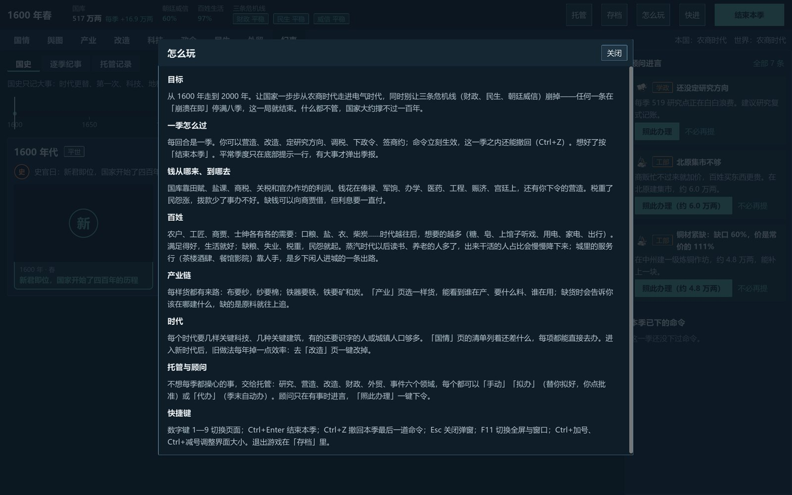
